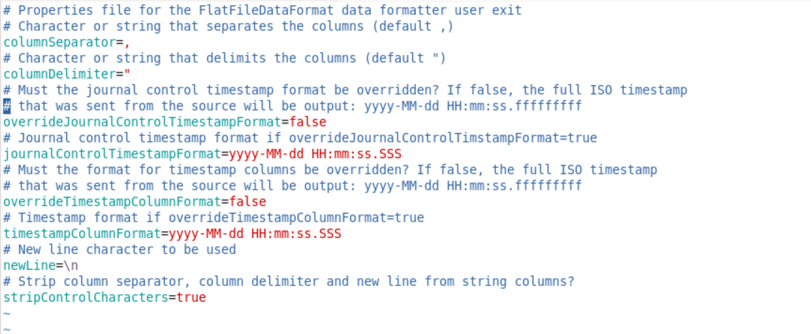
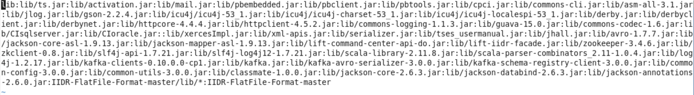
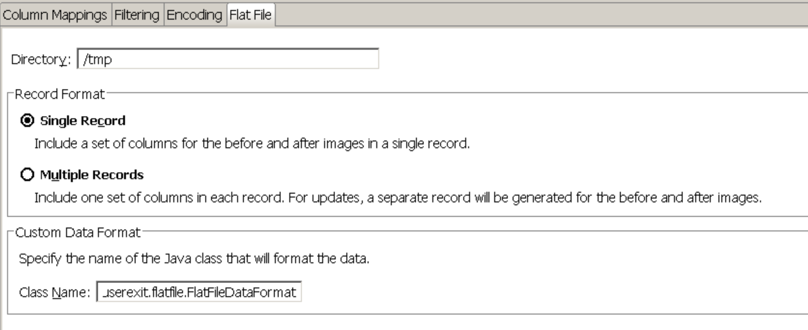

# IBM InfoSphere Data Replication User Exit - Flat File custom Formatter 

## Installation
The GitHub repository contains the source but also the data formatter user exit in its compiled form, enclosed in a jar file. If you wish, you can choose to build the jar file yourself using Ant, or to manually compile the user exit. If you wish to do so, please refer to the [Compilation](#compilation) section.

Download and unzip the master zip file from GitHub through the following link: [Download Zip](https://github.com/lavalex/IIDR-FlatFile-Format/archive/master.zip). The unzipped directory can be placed anywhere on the server that runs the CDC for DataStage engine; we recommend to unzip it under the CDC for DataStage engine's home directory (hereafter referred to as `<cdc_home>`)

## Configuration
In most scenarios you will need to perform a couple of configuration tasks:
- Update the configuration properties in the FlatFileDataFormat.properties file
- Add the user exit and its configuration file to the classpath of the CDC engine

### Setting the configuration properties
Update the `FlatFileDataFormat.properties` file with your favourite editor.

An example of the Flat File formatting properties can be found below


### Update the CDC engine's classpath
Assuming you have unzipped the file under the `<cdc_home>` directory, and the directory is called `IIDR-FlatFile-Format-master`, add the following entries to the end of the classpath specified in the `<cdc_home>/conf/system.cp`: <br/>
`:IIDR-FlatFile-Format-master/lib/*:IIDR-FlatFile-Format-master`

Example classpath for CDC engine:
 
 
The `lib/*` classpath entry is needed to let CDC for DataStage find the jar file; the main directory holds the properties file that is read from within the FlatFile formatting user exit.

Once you have updated the classpath, restart the CDC instance(s) for the changes to take effect.

## Configuring the subscription
Now that the setup tasks have been done and the formatter user exit is available to the CDC engine, you must create a subscription that targets the CDC for DataStage, writing to flat files on the local file system and subsequently map the tables.

Finally, configure the subscription-level user exit. The full name of the user exit is: `com.ibm.replication.cdc.userexit.flatfile.FlatFileDataFormat`



## Replicating changes
Below you will find an example of three change records: first and insert, then and update and finally a delete of the same record.

```
"2018-01-09 08:36:23.969","730860","I","DB2INST1",,,,,,,,,,,,,"876255","35","SOMMERVILLE NATIONAL LEASING"," ","255 DALESFORD RD."," ","LANSING","MI","A","49979","45000","251"
"2018-01-09 08:38:36.000","730861","U","DB2INST1","876255","35","SOMMERVILLE NATIONAL LEASING"," ","255 DALESFORD RD."," ","LANSING","MI","A","49979","45000","251","876255","35","SOMMERVILLE NATIONAL LEASING"," ","255 DALESFORD RD."," ","LANSING","MI","A","49980","45000","251"
"2018-01-09 08:38:50.000","730862","D","DB2INST1","876255","35","SOMMERVILLE NATIONAL LEASING"," ","255 DALESFORD RD."," ","LANSING","MI","A","49980","45000","251",,,,,,,,,,,,
```

## Compilation
If you wish to compile the user exit yourself, the easiest method is to use Ant ([https://ant.apache.org/bindownload.cgi](https://ant.apache.org/bindownload.cgi)). 

Once you have this installed:
- Ensure that the ant executable is in the path
- Go to the directory where you unzipped the user exit master file
- Update the `ant.properties` and update the `CDC_ENGINE_HOME` property to match the location where you installed the CDC engine
- Check the target version to be used (this is the Java version of the compiled objects) and should match the version of the Java Runtime Engine that is included with CDC
- Run `ant`
- First the sources will be compiled into their respective .class files and finally the class files are packaged into a jar file that is contained in the `lib` directory
